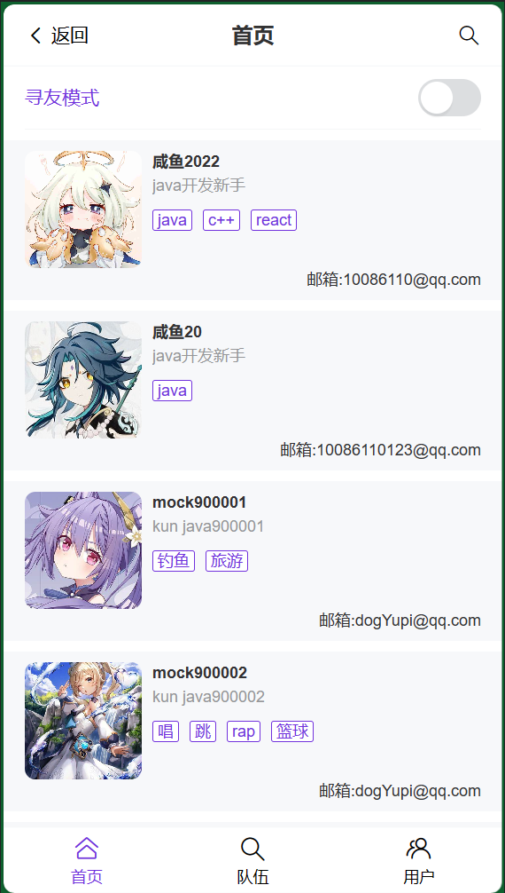
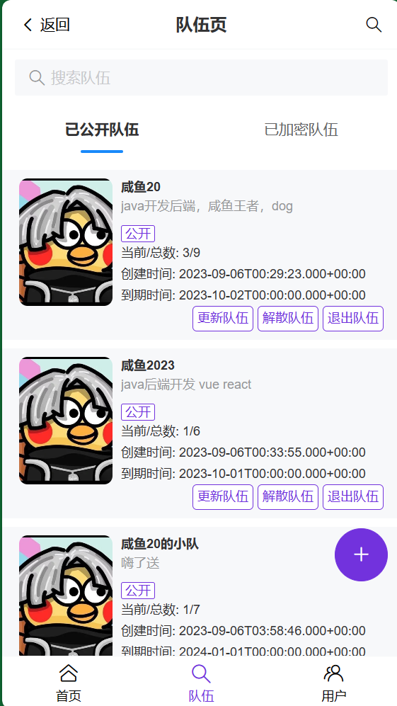
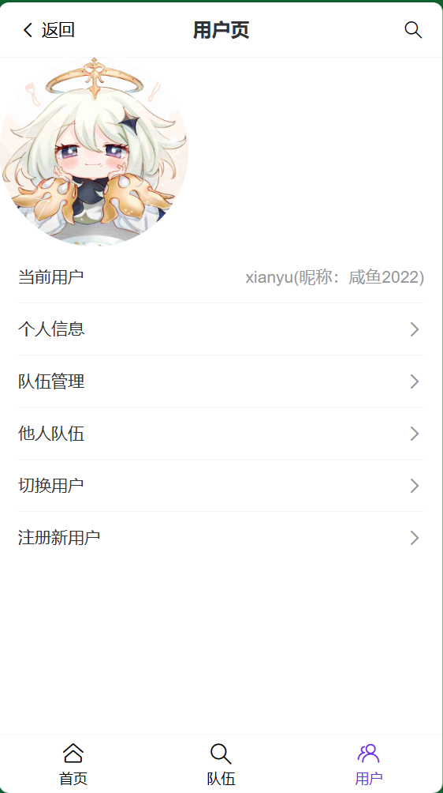
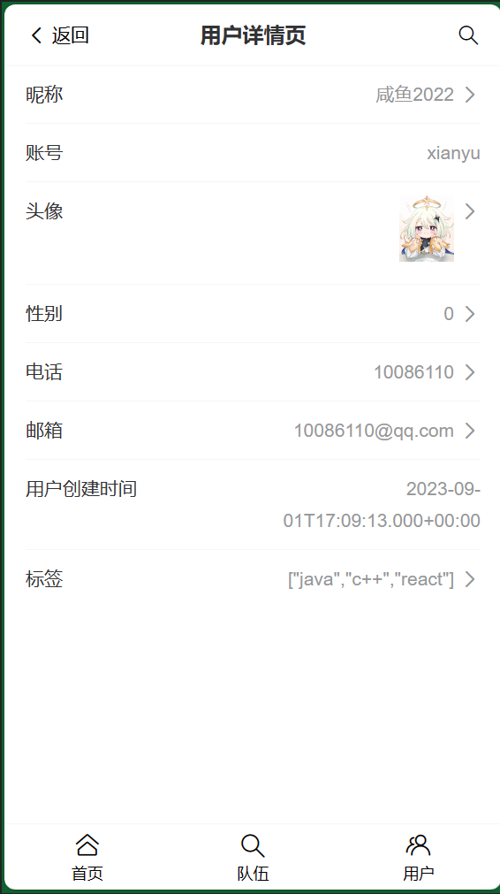
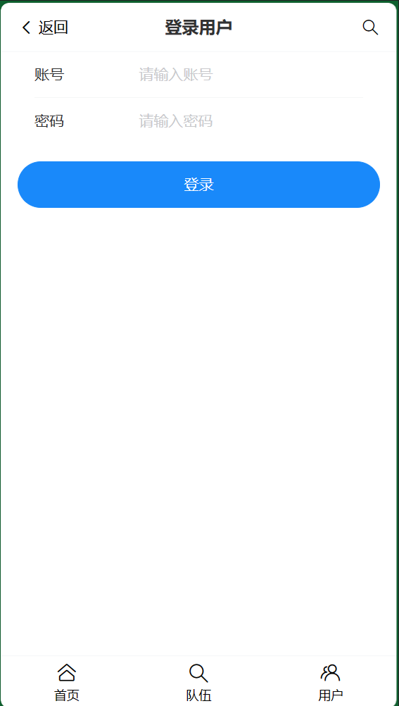
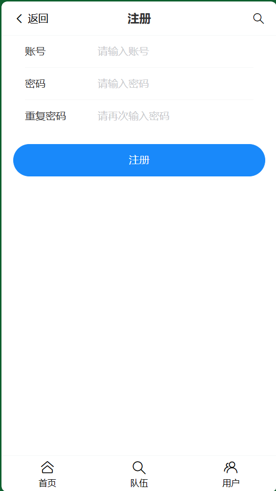
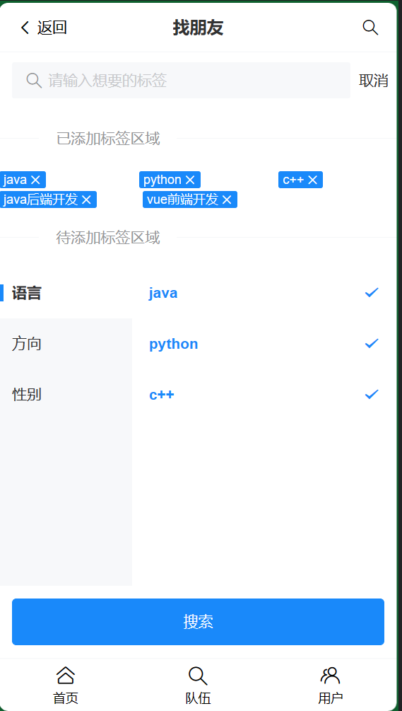
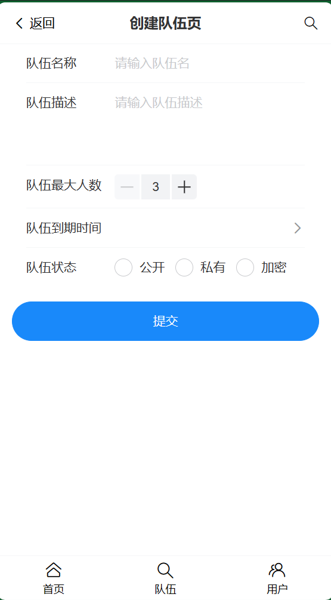

<<<<<<< HEAD
# 寻友

[toc]

     
     
     


### 主流框架 & 特性

- Spring Boot 2.7.x
- Spring MVC
- MyBatis + MyBatis Plus 数据访问（开启分页）
- Spring Boot 调试工具和项目处理器
- Spring AOP 切面编程
- Spring Scheduler 定时任务
- Spring 事务注解

### 数据存储

- MySQL 数据库
- Redis 内存数据库


### 工具类

- Easy Excel 表格处理
- Hutool 工具库
- Gson 解析库
- Apache Commons Lang3 工具类
- Lombok 注解

### 业务特性

- Spring Session Redis 分布式登录
- 全局请求响应拦截器（记录日志）
- 全局异常处理器
- 自定义错误码
- 封装通用响应类
- Swagger + Knife4j 接口文档
- 自定义权限注解 + 全局校验
- 全局跨域处理
- 长整数丢失精度解决
- 多环境配置


## 业务功能

- 用户登录、注册、注销、更新、检索、权限管理
- 按标签搜索用户
- 主页寻友模式（匹配相似用户）:用户推荐、用户匹配
- 创建队伍、加入队伍、修改队伍、解散队伍、离开队伍

### 单元测试

- JUnit5 单元测试
- 示例单元测试类

### 架构设计

- 合理分层


## 快速上手


### MySQL 数据库

1）修改 `application.yml` 的数据库配置为你自己的：

```yml
spring:
  datasource:
    driver-class-name: com.mysql.cj.jdbc.Driver
    url: jdbc:mysql://localhost:3306/my_db
    username: root
    password: 123456
```

2）执行 `sql/create_table.sql` 中的数据库语句，自动创建库表

3）启动项目，访问 `http://localhost:8080/api/doc.html` 即可打开接口文档，不需要写前端就能在线调试接口了~


### Redis 分布式登录

1）修改 `application.yml` 的 Redis 配置为你自己的：

```yml
spring:
  redis:
    database: 1
    host: localhost
    port: 6379
    timeout: 5000
    password: 123456
```

2）修改 `application.yml` 中的 session 存储方式：

```yml
spring:
  session:
    store-type: redis
```

3）移除 `MainApplication` 类开头 `@SpringBootApplication` 注解内的 exclude 参数：

修改前：

```java
@SpringBootApplication(exclude = {RedisAutoConfiguration.class})
```

修改后：


```java
@SpringBootApplication
```

```java
// todo 取消注释开启任务
//@Component
```
