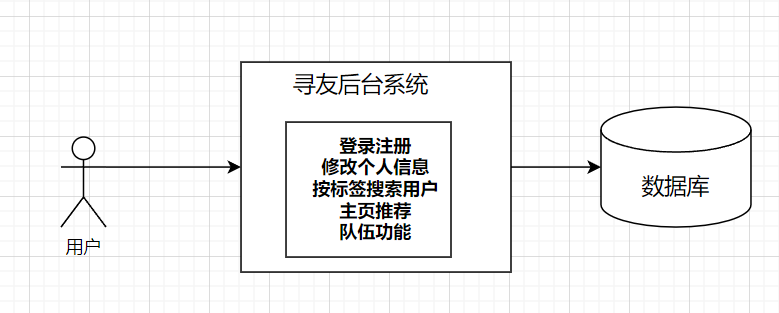

<h1 align="center">Find-Friend</h1>
<p align="center"><strong>一个帮助大家找到志同道合朋友的移动端网站 </strong></p>

## 项目介绍


**用户可登录注册进入到首页（首页显示默认推荐用户），可以点击首页的寻友模式来找朋友，系统会匹配TOP N个最相似的用户（按标签匹配）。还可以点击右上角的搜索图标进入到标签搜索页，在该页可以挑选、搜索、添加标签，点击搜索，系统会根据已添加的标签去找到拥有这些标签的用户。**

**支持组队功能。用户可以在队伍页搜索队伍（公开队伍、已加密队伍），点击+号可以创建队伍，还可以加入队伍、退出队伍。队长能更新队伍、解散队伍，如果队长退出队伍，队长权限会自动移交给队伍内最早加入队伍的成员。**

**在用户页，可以管理个人信息，可以管理自己作为队长的队伍，可以查看已加入的他人队伍（自己不是队长）**


## 网站导航

- [**寻友 后端**](https://github.com/xianyu2023/find-friend-backend)
- [**寻友 前端**️](https://github.com/xianyu2023/find-friend-front)


## 项目流程



## 快速启动

### 前端

环境要求：Node.js = 18.16

安装依赖：

```
yarn or  npm install
```

启动：

```
yarn run dev or npm run start:dev
```

部署：

```
yarn build or npm run build
```

### 后端

执行sql目录下create_table.sql创建库表

## 项目选型

### 后端

- Spring Boot 2.7.2
- Spring MVC
- MySQL 数据库
- Swagger + Knife4j 接口文档
- Spring Data Redis 分布式登录
- Redisson分布式锁
- Spring AOP 切面编程
- Spring Scheduler 定时任务
- Spring 事务注解
- MyBatis-Plus 及 MyBatis X 自动生成

### 工具类

- Easy Excel 表格处理
- Hutool 工具库
- Gson 解析库
- Apache Commons Lang3 工具类
- Lombok 注解

### 单元测试

- JUnit5 单元测试

### 业务特性

- 全局请求响应拦截器（记录日志）
- 全局异常处理器
- 自定义错误码
- 封装通用响应类
- 自定义权限注解 + 全局校验
- 全局跨域处理
- 长整数丢失精度解决
- 多环境配置


### 前端

- Vue3

- vant3 组件库

- vite2构建工具

- Axios请求工具

- Nginx单机部署


## 业务功能

- 用户登录、注册、注销、更新、检索、权限管理
- 按标签搜索用户
- 主页寻友模式（匹配相似用户）:用户推荐、用户匹配
- 创建队伍、加入队伍、修改队伍、解散队伍、离开队伍


## 前端展示

### 首页


#### 首页寻友模式


###  标签搜索页


### 队伍页


#### 创建队伍页


### 用户页


#### 用户详情页


### 登录/注册


